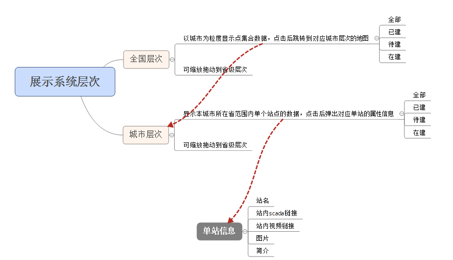

### 展示系统地图站点显示需求分析

--------------------------------------

##### 1. 全国层次

   >**显示数据**：以城市为粒度显示站点集合数据
   >
   >**站点数据分类**：
   >
   >- 已建
   >- 待建
   >- 在建
   >- 全部
   >
   >**动作**：
   >
   >- 点击   跳转到对应城市层次级地图
   >- 缩放拖动   到省级层次

##### 2. 城市层次

   > **显示数据**：显示本城市所在省范围内单个站点的数据
   >
   > **站点数据分类**：
   >
   > - 已建
   > - 待建
   >
   > - 在建
   >
   > - 全部
   >
   > **动作**：
   >
   > - 点击   弹出对应单站的属性信息
   > - 缩放拖动   到省级层次

##### 3. 单站信息

   >- 站名
   >- 站内scada链接
   >- 站内视频链接
   >- 图片
   >- 简介

##### 4. 结构图

   

