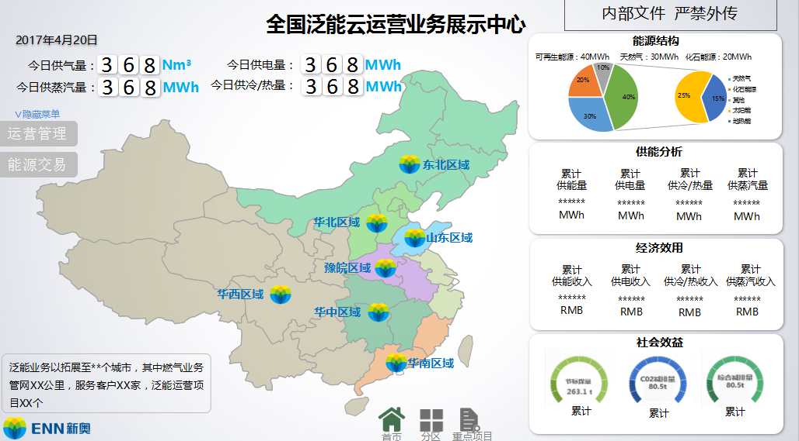

### 展示系统数据交互格式

--------------------------

##### 1. 获取泛能站列表

> **api_url?scope=**
>
> ​	scope为预留参数，根据此参数值不同，返回全国或者各个区域的泛能站列表，默认为全国
>
> **返回json格式**
> ```json
> ｛
>   "title": "泛能站列表",
>   "struct": [
>
>     {"id":1001, "name":"南北苑", "longitude":123.429096,"latitude":41.796767},
>
>     {"id":1002, "name":"新朝阳", "longitude":121.472644,"latitude":31.231706}
>
>   ]		
>
> ｝
> ```

##### 2. 能源结构模块 

> **api_url1?proj=**
>
> ​	proj接受两类参数：
>
>   -   范围id，根据此参数值不同，返回全国或者各个区域的能源结构信息，默认为全国
>
>   -   单站id，根据id值不同，返回单个站的能源结构信息，默认为id=1站的信息
>
>  **返回json格式**
>
> ```json
> {
> 	"title" : "能源结构",
> 	"struct": [
> 		{
> 			"name" : "可再生能源",
> 			"value" : "40",
> 			"percent" : "33",
> 			"unit" : "Mwh"
> 		},
> 		{
> 			"name" : "天然气",
> 			"value" : "40",
> 			"percent" : "33",
> 			"unit" : "Mwh"
> 		},
> 		{
> 			"name" : "化石能源",
> 			"value" : "40",
> 			"percent" : "34",
> 			"unit" : "Mwh"
> 		}
> 	]
> }
> ```

>**api_url2?proj=**
>
>​	proj接受两类参数：
>
>- 范围id，根据此参数值不同，返回全国或者各个区域的可再生能源结构信息，默认为全国
>- 单站id，根据id值不同，返回单个站的可再生能源结构信息，默认为id=1站的信息
>
> **返回json格式**
>
>```json
>{
>	"title" : "可再生能源",
>	"struct": [
>		{
>			"name" : "太阳能",
>			"value" : "40",
>			"percent" : "50",
>			"unit" : "Mwh"
>		},
>		{
>			"name" : "地热能",
>			"value" : "40",
>			"percent" : "50",
>			"unit" : "Mwh"
>		}
>	]
>}
>```

##### 3. 供能分析

>**api_url1?proj=**
>
>​	proj接受两类参数：
>
>- 范围id，根据此参数值不同，返回全国或者各个区域的供能分析信息，默认为全国
>- 单站id，根据id值不同，返回单个站的供能分析信息，默认为id=1站的信息
>
>**返回json格式**
>
>```json
>{
>	"title" : "供能分析",
>	"struct": [
>		{
>			"name" : "累计供能量",
>			"value" : "40",
>			"percent" : "",
>			"unit" : "Mwh"
>		},
>		{
>			"name" : "累计供电量",
>			"value" : "40",
>			"percent" : "",
>			"unit" : "Mwh"
>		},
>		{
>			"name" : "累计供蒸汽量",
>			"value" : "40",
>			"percent" : "",
>			"unit" : "Mwh"
>		},
>		{
>			"name" : "累计冷热量",
>			"value" : "40",
>			"percent" : "",
>			"unit" : "Mwh"
>		}
>	]
>}
>```

##### 4. 经济效用

>**api_url1?proj=**
>
>​	proj接受两类参数：
>
>- 范围id，根据此参数值不同，返回全国或者各个区域的经济效用信息，默认为全国
>- 单站id，根据id值不同，返回单个站的经济效用信息，默认为id=1站的信息
>
>**返回json格式**
>
>```json
>{
>	"title" : "经济效用",
>	"struct": [
>		{
>			"name" : "累计供能收入",
>			"value" : "40",
>			"percent" : "",
>			"unit" : "RMB"
>		},
>		{
>			"name" : "累计供电收入",
>			"value" : "40",
>			"percent" : "",
>			"unit" : "RMB"
>		},
>		{
>			"name" : "累计供蒸汽收入",
>			"value" : "40",
>			"percent" : "",
>			"unit" : "RMB"
>		},
>		{
>			"name" : "累计冷热收入",
>			"value" : "40",
>			"percent" : "",
>			"unit" : "RMB"
>		}
>	]
>}
>```

##### 5. 社会效益

>**api_url1?proj=**
>
>​	proj接受两类参数：
>
>- 范围id，根据此参数值不同，返回全国或者各个区域的社会效益信息，默认为全国
>- 单站id，根据id值不同，返回单个站的社会效益信息，默认为id=1站的信息
>
>**返回json格式**
>
>```json
>{
>	"title" : "社会效益",
>	"struct": [
>		{
>			"name" : "累计节煤标量",
>			"value" : "40",
>			"percent" : "",
>			"unit" : "T"
>		},
>		{
>			"name" : "累计CO2减排量",
>			"value" : "40",
>			"percent" : "",
>			"unit" : "T"
>		},
>		{
>			"name" : "累计综合减排量",
>			"value" : "40",
>			"percent" : "",
>			"unit" : "T"
>		} 
>	]
>}
>```

##### 6. 今日能源信息

>**api_url?proj=**
>
>​	proj接受两类参数：
>
>- 范围id，根据此参数值不同，返回全国或者各个区域的今日能源信息，默认为全国
>- 单站id，根据id值不同，返回单个站的今日能源信息，默认为id=1站的信息
>
>**返回json格式**
>
>```json
>{
>	"title" : "2017年6月22日",
>	"struct": [
>		{
>			"name" : "今日供能量",
>			"value" : "40",
>			"percent" : "",
>			"unit" : "Mwh"
>		},
>		{
>			"name" : "今日供电量",
>			"value" : "40",
>			"percent" : "",
>			"unit" : "Mwh"
>		},
>		{
>			"name" : "今日供蒸汽量",
>			"value" : "40",
>			"percent" : "",
>			"unit" : "Mwh"
>		},
>		{
>			"name" : "今日冷热量",
>			"value" : "40",
>			"percent" : "",
>			"unit" : "Mwh"
>		}
>	]
>}
>```

##### TO DO

--------------------------------------------------------

17.6.23 需求 from 张博，能源站列表添加状态: 已建站，建设中, 以及属性信息  

##### 参考

> - *王杰整理的数据*
>
> 
>
> - *ppt原型*
>
>   


